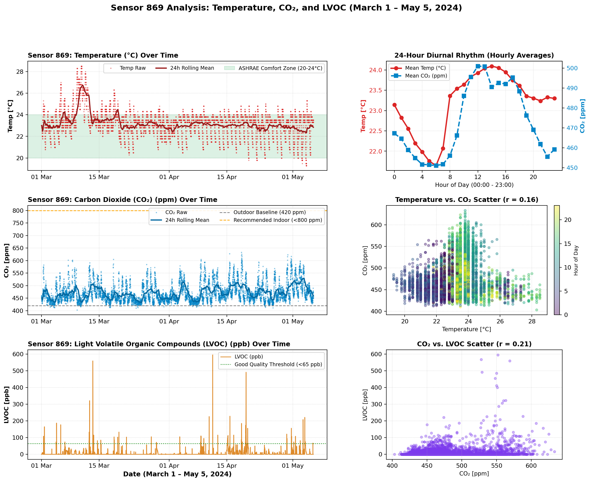
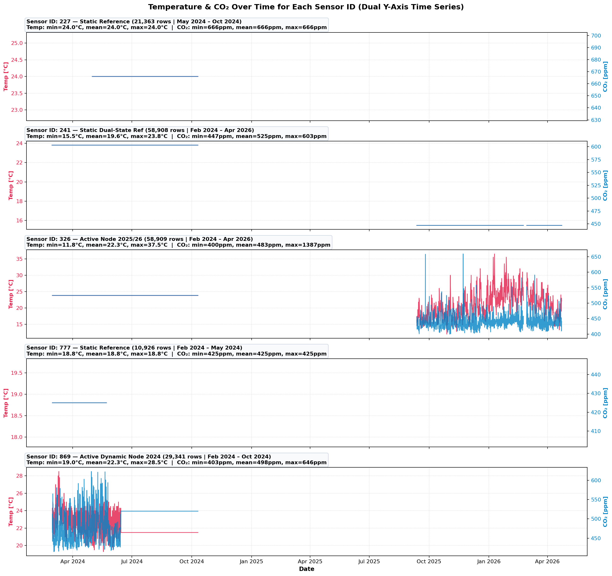

# MMA3001 Environmental Sensor Data Analysis

Comprehensive analytical pipeline and visualization suite for 180,000 environmental telemetry records collected across 5 IoT sensor nodes.

## 📌 Repository Overview

- **Dataset**: `5EnvSensor_Cleaned_Tabular.csv` (15.8 MB, 179,447 rows)
- **Sensor Nodes**: `227`, `241`, `326`, `777`, `869`
- **Tracked Parameters**: Temperature, Humidity, CO₂, LVOC/TVOC, Formaldehyde (HCHO), Particulate Matter (PM1.0, PM2.5, PM4.0, PM10), Barometric Pressure, and Battery Voltage.

---

## 🔬 Featured Analysis: Sensor 869 (March 1 – May 5, 2024)

Multi-parameter comparison analyzing **Time vs. Temperature, CO₂, and LVOC**:



### Key Observations:
- **Diurnal Trajectory:** Temperature and CO₂ rise synchronously between 07:00 AM and 14:00 PM, driven by occupancy and HVAC operation.
- **LVOC Spikes:** Peak emission events occur in the evening hours (~21:00 PM), likely attributable to cleaning solvents or off-gassing.

---

## 📊 Multi-Sensor Time Series (Temp & CO₂ by ID)



---

## 🚀 Running the Analysis Locally

### Requirements
```bash
pip install pandas numpy matplotlib
```

### Run Comparison Script
```bash
python compare_869_march_to_may.py
```

Generated plots will be saved directly into the `plots/` directory.
